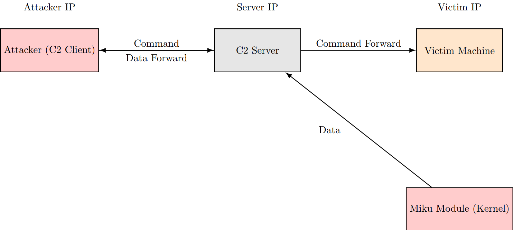

# Hatsune-Mikernel

/!\ Work In progress, project just started (february 2025) /!\

Custom Linux Rootkit


⠀⠀⠀⠀⠀⠀⠀⠀⠀⠀⠀⠀
⠀⠀⠀⠀⠀⠀⠀⠀⠀⠀⠀⠀⠀⠀⠀⠀⠀⠀⠀⠀⠀⠀⠀⣤⣀⣀⠀⠀⣀⡠⠴⠒⠚⠉⠉⠓⠒⠦⣄⣶⠒⣷⡀⠀⠀⠀⠀⠀⠀⠀⠀⠀⠀⠀⠀⠀⠀⠀
⠀⠀⠀⠀⠀⠀⠀⠀⠀⠀⠀⠀⠀⠀⠀⠀⠀⠀⠀⠀⠀⠀⠀⠘⡷⢬⣉⠉⠁⠀⠀⠀⠀⠀⠀⠀⠀⠠⡌⠻⣧⢻⣧⣤⠀⠀⠀⠀⠀⠀⠀⠀⠀⠀⠀⠀⠀⠀
⠀⠀⠀⠀⠀⠀⠀⠀⠀⠀⠀⠀⠀⠀⠀⠀⠀⠀⠀⠀⠀⠀⠀⣖⠗⡋⢹⠀⠀⢰⡄⠀⠀⢸⣷⡀⠀⣠⠽⣆⢼⣇⢻⣸⡄⠀⠀⠀⠀⠀⠀⠀⠀⠀⠀⠀⠀⠀
⠀⠀⠀⠀⠀⠀⠀⠀⠀⠀⠀⠀⠀⠀⠀⠀⠀⠀⠀⠀⠀⢀⡜⣡⣶⢋⡏⠙⢢⣏⣇⠀⠀⠈⣇⡵⡏⠀⠀⢹⡏⢾⣿⠃⢿⡆⠀⠀⠀⠀⠀⠀⠀⠀⠀⠀⠀⠀
⠀⠀⠀⠀⠀⠀⠀⠀⠀⠀⠀⠀⠀⠀⠀⠀⠀⠀⠀⠀⠀⣾⢿⢻⣏⣿⡇⡄⣾⠀⠹⡄⠄⠀⡇⠀⠹⣤⠈⠹⣿⣾⢸⠀⢘⣷⣄⣀⠀⠀⠀⠀⠀⠀⠀⠀⠀⠀
⠀⠀⠀⠀⠀⠀⠀⠀⠀⠀⠀⠀⠀⠀⠀⠀⠀⠀⠀⠀⢠⣴⣯⣿⣽⣿⣷⢸⡗⠦⣄⡹⣼⣄⣿⣴⠛⠹⡄⡇⣿⣿⠾⠚⢹⢿⢽⣽⡇⠀⠀⠀⠀⠀⠀⠀⠀⠀
⠀⠀⠀⠀⠀⠀⠀⠀⠀⠀⠀⠀⠀⠀⠀⠀⠀⠀⠀⠀⣸⣿⣞⣾⣿⢿⣯⢻⢻⡴⠞⠁⠈⠻⣿⣌⡉⠓⣿⣰⡿⠀⠀⠀⠸⡜⡾⣿⡇⠀⠀⠀⠀⠀⠀⠀⠀⠀
⠀⠀⠀⠀⠀⠀⠀⠀⠀⠀⠀⠀⠀⠀⠀⠀⠀⠀⢀⡴⣡⠊⢸⣹⠁⠈⠙⣾⡄⠁⠀⢰⠛⠉⠉⠉⢳⣀⣿⣿⠃⠀⠀⣀⣀⣧⣿⡞⣷⡀⠀⠀⠀⠀⠀⠀⠀⠀
⠀⠀⠀⠀⠀⠀⠀⠀⠀⠀⠀⠀⠀⠀⠀⠀⠀⣠⠋⡴⠁⠀⠸⢿⣤⣤⣤⣹⣿⣷⣶⣾⣷⣶⣶⣺⣋⣽⣿⣷⠶⠟⠛⠋⢧⠀⠀⠸⡜⣷⠀⠀⠀⠀⠀⠀⠀⠀
⠀⠀⠀⠀⠀⠀⠀⠀⠀⠀⠀⠀⠀⠀⠀⢀⡜⠁⡰⠁⠀⠀⢠⡿⠀⠀⠀⠉⠉⠉⠙⢻⡟⣹⣿⠃⣿⠋⠁⠀⠀⠀⠀⠀⠸⡄⠀⠀⢣⠹⣧⠀⠀⠀⠀⠀⠀⠀
⠀⠀⠀⠀⠀⠀⠀⠀⠀⠀⠀⠀⠀⠀⢠⠏⡀⢠⠇⠀⠀⢠⡿⠁⠀⠀⠀⠀⣤⣶⡴⠚⢻⠡⣸⠀⢹⣆⠀⠀⠀⠀⠀⠀⠀⡇⠀⠀⠸⡄⢻⣇⠀⠀⠀⠀⠀⠀
⠀⠀⠀⠀⠀⠀⠀⠀⠀⠀⠀⠀⠀⢀⡏⣼⠁⢸⠀⠀⠀⣾⠃⠀⠀⠀⠀⠀⢻⣿⣧⣀⣬⠋⠁⠀⣠⣿⣶⣆⠀⠀⠀⠀⠀⡇⠀⠀⠀⡇⠈⣿⡀⠀⠀⠀⠀⠀
⠀⠀⠀⠀⠀⠀⠀⠀⠀⠀⠀⠀⠀⣸⣸⣿⠀⡇⠀⢰⣸⡟⠀⠀⠀⣀⣠⠴⠚⣟⣻⣧⣯⣗⣤⣾⣿⣿⡿⠋⠀⠀⠀⠀⣸⣤⠀⠀⠀⡇⡆⢻⠃⠀⠀⠀⠀⠀
⠀⠀⠀⠀⠀⠀⠀⠀⠀⠀⠀⠀⠀⣿⡿⢸⡀⣇⠀⣸⣿⡁⠀⣾⣻⡁⣀⣤⣶⠟⠋⠉⠛⢿⣋⣻⡏⠉⠀⠀⠀⠀⠀⢰⣿⡇⠀⠀⠀⣷⡇⣸⡄⠀⠀⠀⠀⠀
⠀⠀⠀⠀⠀⠀⠀⠀⠀⠀⠀⠀⠀⠿⠇⠀⢧⢸⠀⣿⡿⠇⠀⠈⠛⠛⠋⠉⠀⠀⠀⠀⠀⡟⠀⣿⠇⠀⠀⠀⠀⠀⢠⣿⣿⡇⠀⠀⣰⡿⣧⣿⠃⠀⠀⠀⠀⠀
⠀⠀⠀⠀⠀⠀⠀⠀⠀⠀⠀⠀⠀⠀⠀⠀⠀⢿⣄⣹⡇⠀⠀⠀⠀⠀⠀⠀⠀⠀⠀⠀⢰⡇⠀⣿⠀⠀⠀⠀⠀⠀⣸⡿⢸⠁⢠⣾⠋⢰⣿⡏⠀⠀⠀⠀⠀⠀
⠀⠀⠀⠀⠀⠀⠀⠀⠀⠀⠀⠀⠀⠀⠀⠀⠀⠀⠉⠛⠛⠀⠀⠀⠀⠀⠀⠀⠀⠀⠀⠀⣼⣶⣶⡿⠀⠀⠀⠀⠀⠀⠉⠁⢸⣶⡟⠁⠀⠾⠟⠀⠀⠀⠀⠀⠀⠀
⠀⠀⠀⠀⠀⠀⠀⠀⠀⠀⠀⠀⠀⠀⠀⠀⠀⠀⠀⠀⠀⠀⠀⠀⠀⠀⠀⠀⠀⠀⠀⠀⠈⠉⠉⠀⠀⠀⠀⠀⠀⠀⠀⠀⠈⠉⠀⠀⠀⠀⠀⠀⠀⠀⠀⠀⠀⠀


## Features to be Added

Illustration without bluepill

 

- LPE (Local Privilege Escalation) on a process
- Syscall hooking communicating with a C2
- Access to critical data in kernel memory
- Stealth/Anti-Detection
- Obfuscation
- Persistence

- IF POSSIBLE , bluepill with a custom hypervisor

## How to compile and load the module

```
make modules
sudo insmod miku_module.ko
```

## How to use 

## How to unload 
```
sudo rmmod miku_module.ko
```

## How to clean

```
make clean
```
